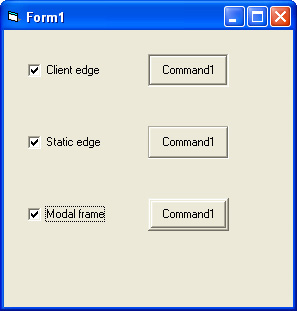



## C\+\+ Extended Styles

### Description

this code extends new styles for command buttons: Modal frame,Client Edge and Static Edge just like in vc++. You can use it to extend other controls styles.
 
### More Info
 

             |
---                |---
**Submitted On**   |2002-08-15 15:40:42
**By**             |[bmbsa](https://github.com/Planet-Source-Code/PSCIndex/blob/master/ByAuthor/bmbsa.md)
**Level**          |Advanced
**User Rating**    |4.8 (86 globes from 18 users)
**Compatibility**  |VB 5\.0, VB 6\.0
**Category**       |[Custom Controls/ Forms/  Menus](https://github.com/Planet-Source-Code/PSCIndex/blob/master/ByCategory/custom-controls-forms-menus__1-4.md)
**World**          |[Visual Basic](https://github.com/Planet-Source-Code/PSCIndex/blob/master/ByWorld/visual-basic.md)
**Archive File**   |[C\+\+\_Extend1184248152002\.zip](https://github.com/Planet-Source-Code/bmbsa-c-extended-styles__1-37968/archive/master.zip)

